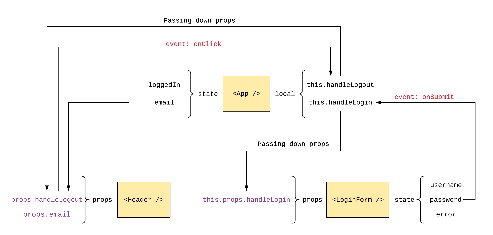

# react-demo

* Code from _7/5_ is on branch: **state-intro**
* Code from _8/5_ is on branch: **fetch-example**
* Code from _14/5_ is on branch: **LoginForm**

## Flowchart



> App knows about the state of LoginForm because we are sending the state with a function that belongs to App. LoginForm does not know about the state of App and do not care about it. LoginForm knows that it should be aware of displaying errors if the input is incorrect. If the input input is correct, LoginForm will call the function passed down from App with its own internal state.

> Header knows only about some of the state of App (the state that is passed down by us explicitly via `props`) but not the state of LoginForm. If we were to store the state 'loggedIn' inside of LoginForm it would be hard to pass it to Header. But now when the state 'loggedIn' is shared between the two components, this becomes easier. Information is not shared between siblings, only through the parent. The children knows about the information that the parent tells them but does not know about its siblings. The children can pass information to the parent if the parent allows it (via a function). The children can have information that the parent doesn't know about and the parent can have information that the children doesn't know anything about. The only way for communication is via `props`.

## TODO

* Divide Bootstrap-form
* Create separate views based on state
* Add prop-types

## `prop-types` reference

* [https://www.npmjs.com/package/prop-types](https://www.npmjs.com/package/prop-types)

```js
MyComponent.propTypes = {
  // You can declare that a prop is a specific JS primitive. By default, these
  // are all optional.
  optionalArray: PropTypes.array,
  optionalBool: PropTypes.bool,
  optionalFunc: PropTypes.func,
  optionalNumber: PropTypes.number,
  optionalObject: PropTypes.object,
  optionalString: PropTypes.string,
  optionalSymbol: PropTypes.symbol,
 
  // Anything that can be rendered: numbers, strings, elements or an array
  // (or fragment) containing these types.
  optionalNode: PropTypes.node,
 
  // A React element.
  optionalElement: PropTypes.element,
 
  // You can also declare that a prop is an instance of a class. This uses
  // JS's instanceof operator.
  optionalMessage: PropTypes.instanceOf(Message),
 
  // You can ensure that your prop is limited to specific values by treating
  // it as an enum.
  optionalEnum: PropTypes.oneOf(['News', 'Photos']),
 
  // An object that could be one of many types
  optionalUnion: PropTypes.oneOfType([
    PropTypes.string,
    PropTypes.number,
    PropTypes.instanceOf(Message)
  ]),
 
  // An array of a certain type
  optionalArrayOf: PropTypes.arrayOf(PropTypes.number),
 
  // An object with property values of a certain type
  optionalObjectOf: PropTypes.objectOf(PropTypes.number),
 
  // An object taking on a particular shape
  optionalObjectWithShape: PropTypes.shape({
    color: PropTypes.string,
    fontSize: PropTypes.number
  }),
 
  // You can chain any of the above with `isRequired` to make sure a warning
  // is shown if the prop isn't provided.
  requiredFunc: PropTypes.func.isRequired,
 
  // A value of any data type
  requiredAny: PropTypes.any.isRequired,
 
  // You can also specify a custom validator. It should return an Error
  // object if the validation fails. Don't `console.warn` or throw, as this
  // won't work inside `oneOfType`.
  customProp: function(props, propName, componentName) {
    if (!/matchme/.test(props[propName])) {
      return new Error(
        'Invalid prop `' + propName + '` supplied to' +
        ' `' + componentName + '`. Validation failed.'
      );
    }
  },
 
  // You can also supply a custom validator to `arrayOf` and `objectOf`.
  // It should return an Error object if the validation fails. The validator
  // will be called for each key in the array or object. The first two
  // arguments of the validator are the array or object itself, and the
  // current item's key.
  customArrayProp: PropTypes.arrayOf(function(propValue, key, componentName, location, propFullName) {
    if (!/matchme/.test(propValue[key])) {
      return new Error(
        'Invalid prop `' + propFullName + '` supplied to' +
        ' `' + componentName + '`. Validation failed.'
      );
    }
  })
};
```